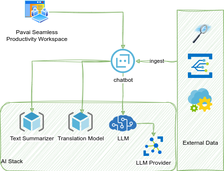
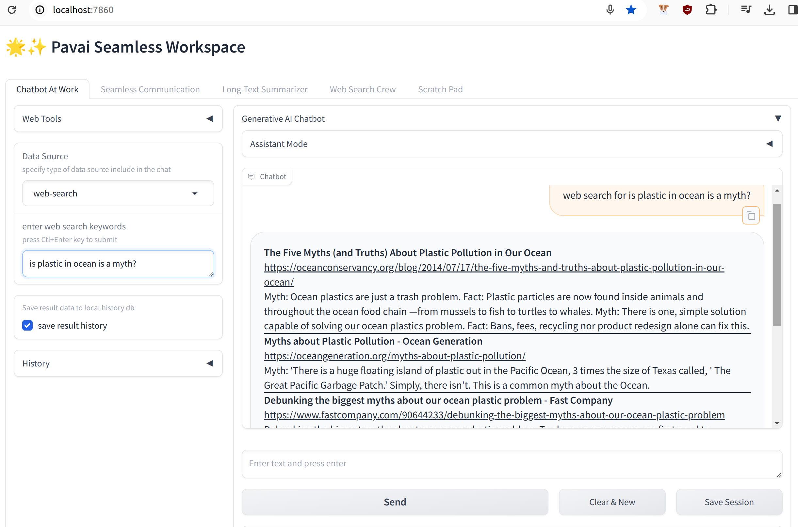
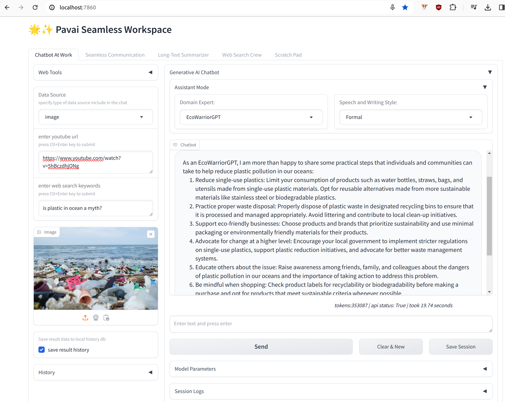
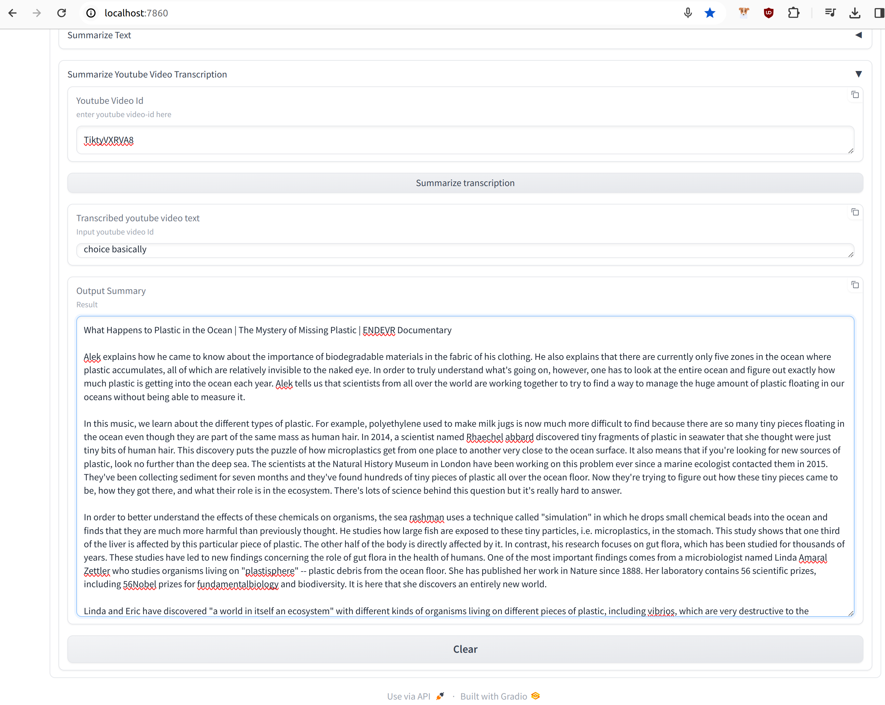
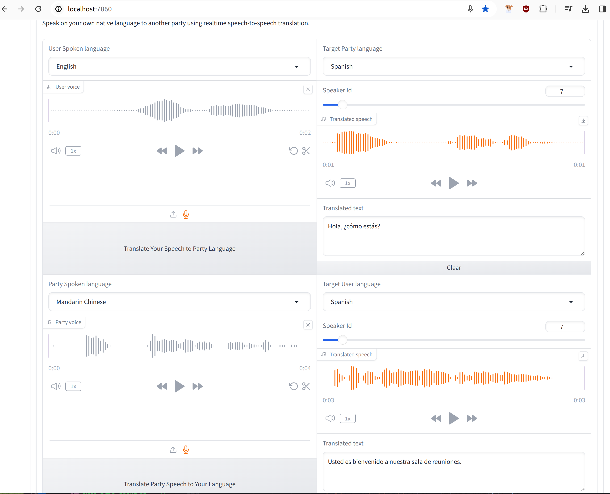
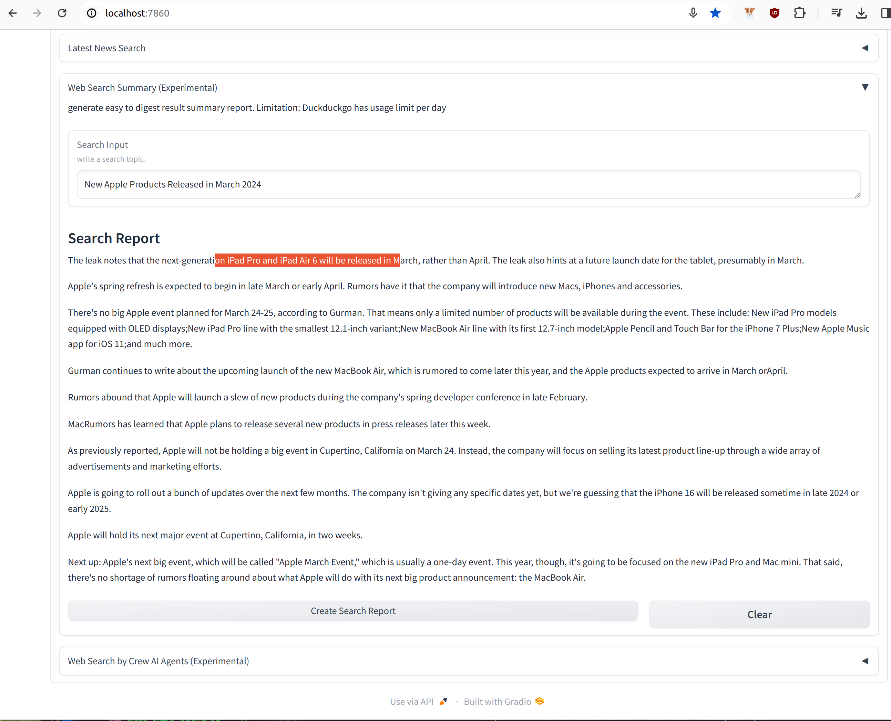

# Pavai-Seamless-Workspace
A productivity focus AI workspace crafted for daily use, characterized by simplicity, minimalism, and effortlessly integrated multilingual communication assistance catering to professionals' needs. 

## Goal
Hope to assist you locally in handling certain situations by providing you with the necessary tools without exposing data to public environment.

> When you want to enhance your chatbot experience by incorporating various data sources such as web data, YouTube videos, and file content, you can integrate the chatbot with different platforms and applications. This integration allows the chatbot to access and utilize data from multiple sources, providing a more comprehensive and personalized experience for users.

> When you feel tire on reading long text, need a precise summary. 

> When you need do research on a topic, you want dispatch the job to research agents to save time.

> When you are in a meeting with someone who speaks a foreign language, it is important to be patient and understanding. Here is a tool to help you navigate the situation stress free. (aka. real-time speech to speech translator)

## Key Features 

1. Integrate multiple data source into a Chatbot conversation
2. Long-term summarizer 
3. Research the web with reporting result 
4. Real-time speech-to-speech translation
5. Customize chatbot assistant persona type and response style 

## Quick Start
When running locally, it's recommend to have at least a GPU with 8 or more VRAM
and 16 GB plus memory.

1. Install Python 3.10+ 
2. Install Poetry for your system (https://python-poetry.org/docs/#installation)
3. clone the repository 
```
$ git clone https://github.com/PavAI-Research/pavai-workspace.git
$ cd pavai-workspace
```
4. First time setup script - download models locally
```
./first_time_setup.sh
```
5. Update configuration setting file (env.shared) if needed 

6. Start the web application as Fastapi or gradio app
```
$./start_fastapi.sh
or
$./start_gradio.sh
```
7. Open your browser then type: http://localhost:7860 or remote a link 

Note: when installing llamacpp-python may not optimized for your system setup.
run command below or equivalent to re-install for your setup.

here's an example for PC with Nvidia GPU
```
CMAKE_ARGS="-DLLAMA_CUBLAS=on" FORCE_CMAKE=1 poetry run pip install llama-cpp-python --upgrade --force-reinstall --no-cache-dir
```

## Design
Follow keep it simple principle.
-  Models.

## Screenshots

-  Web Search.

-  Ocean Plastic.

-  Long-text summarizer

-  Long-text summarizer

-  Long-text summarizer


## Acknowledgments
many thanks to these projects for their inspiration and help, they including llamacpp-python,whisper,fasterwhisper, ollama, styledstts2, piper, vad and meta seamless communication. 

## License Agreement

The source code provided at <https://github.com/PavAI-Research/pavai-workspace> is licensed under the [Apache 2.0 License](./LICENSE) that can be found at the root directory.
